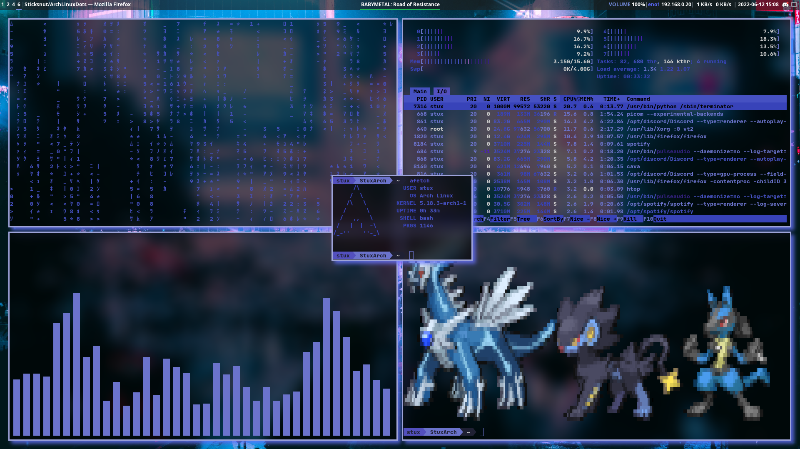

# DotFiles

These configuration files are used on my arch linux machine for ricing i3/polybar and a few other things, these are updated frequently so make sure to check back for updates.
In order to use this download/git clone this repo as a zip and extract the folders to your .config directory

The end result should look like this

NOTE: the KITTY terminal config is not complete and isnt well made at the moment, this will improve in the future, for now feel free to use the terminator config instead.

The CLI tools used in the screenshot are as follows: [Unimatrix](https://github.com/will8211/unimatrix) [Htop](https://htop.dev/) [Cava](https://github.com/karlstav/cava) [Pokeshell](https://github.com/acxz/pokeshell) [Afetch](https://github.com/13-CF/afetch) 
